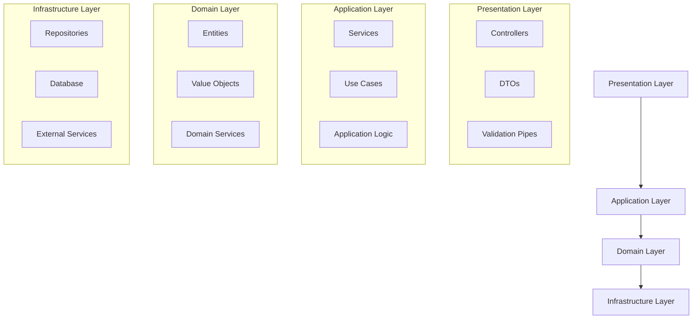
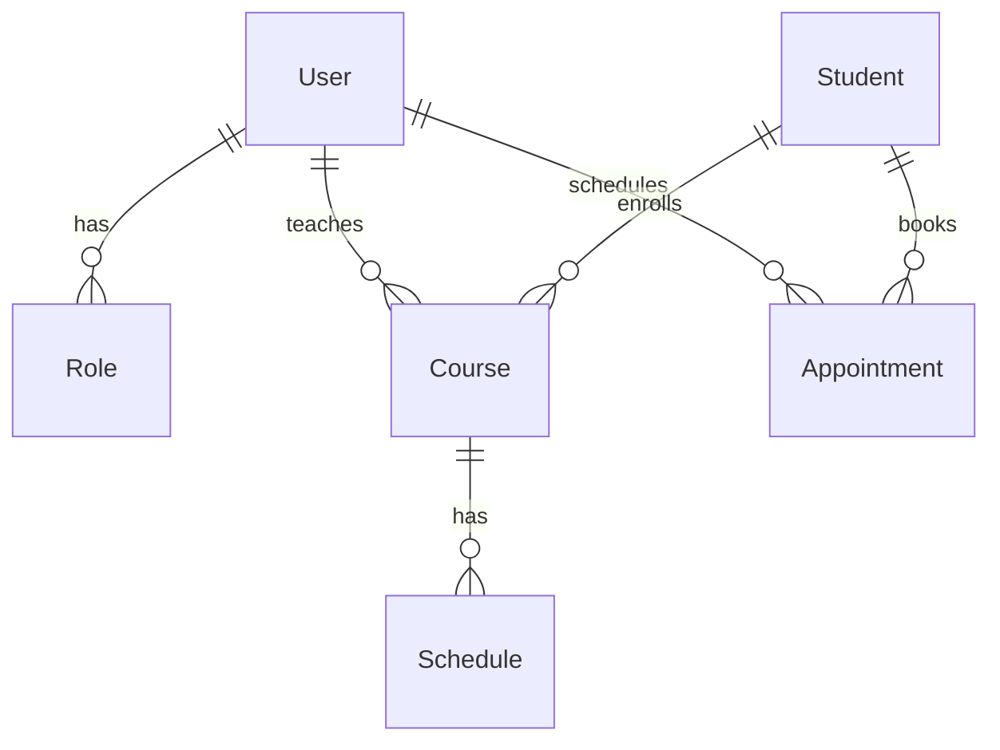
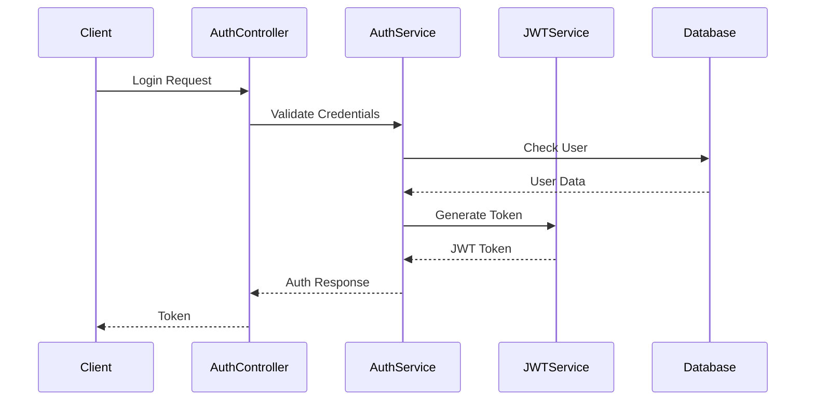
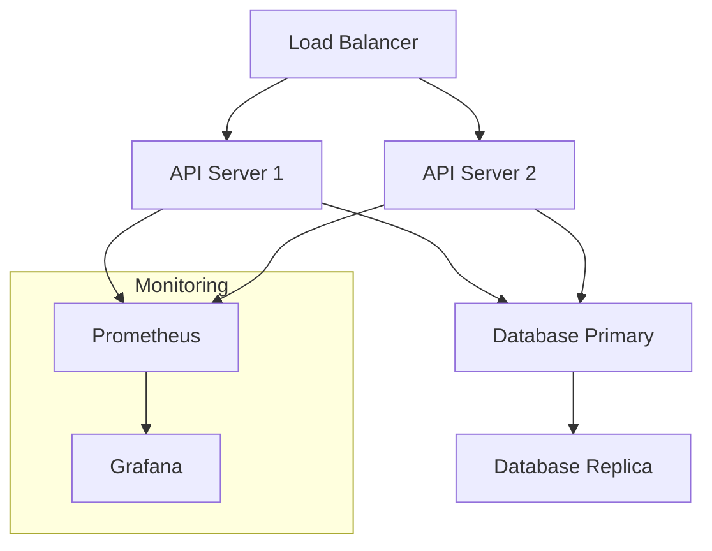

# System Architecture

## Overview

The NestJS Course Management System follows a modular, layered architecture designed for scalability, maintainability, and testability. This document outlines the technical architecture and design decisions of the system.

## Architectural Layers

## Core Components

### 1. Modules

The system is organized into the following main modules:

- **Auth Module**: Handles authentication and authorization
- **User Module**: Manages user profiles and permissions
- **Course Module**: Handles course creation and management
- **Schedule Module**: Manages course scheduling
- **Appointment Module**: Handles appointment booking
- **Student Module**: Manages student information
- **Role Module**: Controls access permissions

### 2. Database Schema

The system uses PostgreSQL with the following main entities:

### 3. Authentication Flow

## Technical Decisions

### 1. Framework Choice

- **NestJS**: Chosen for its modular architecture, TypeScript support, and enterprise-grade features
- **TypeORM**: Selected for database operations due to its TypeScript support and active community

### 2. Security Measures

- JWT-based authentication
- Role-based access control (RBAC)
- Input validation using class-validator
- Password hashing with bcrypt
- CORS configuration
- Rate limiting

### 3. Performance Considerations

- Database indexing
- Query optimization
- Caching strategy
- Connection pooling
- Lazy loading where appropriate

### 4. Testing Strategy

- Unit tests for services and controllers
- Integration tests for API endpoints
- Database transaction rollback in tests
- Mock external services

## Deployment Architecture

## API Design

The system follows RESTful principles with the following conventions:

- Resource-based URLs
- HTTP method semantics
- Proper status codes
- Consistent error responses
- Versioning in URL path
- Pagination support
- Filtering and sorting

## Error Handling

- Global exception filter
- Custom error responses
- Logging strategy
- Error tracking integration

## Monitoring and Logging

- Request logging
- Error tracking
- Performance monitoring
- Database query logging
- Audit trails

## Scalability Considerations

- Horizontal scaling support
- Database sharding strategy
- Cache implementation
- Message queue integration
- Microservices readiness 