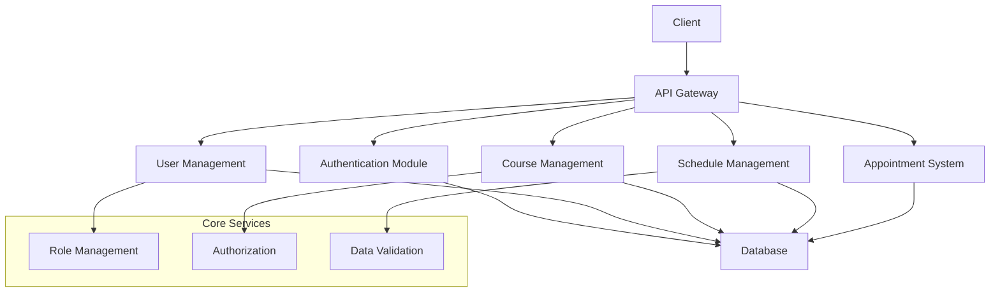

# Project Overview

## Introduction

The NestJS Course Management System is a comprehensive platform designed to manage educational courses, student enrollments, and appointment scheduling. The system provides a robust backend infrastructure for educational institutions to handle their course management needs efficiently.

## Objectives

- Provide a centralized platform for course management
- Enable efficient student enrollment and tracking
- Facilitate appointment scheduling between students and instructors
- Implement role-based access control for different user types
- Ensure secure authentication and authorization

## System Architecture

The system follows a modular architecture built on NestJS, utilizing the following key components:

## Key Features

1. **User Management**
   - User registration and authentication
   - Role-based access control
   - Profile management

2. **Course Management**
   - Course creation and management
   - Student enrollment
   - Course scheduling

3. **Appointment System**
   - Appointment booking
   - Schedule management
   - Calendar integration

4. **Student Management**
   - Student profiles
   - Enrollment tracking
   - Progress monitoring

## Technical Stack

- **Backend Framework**: NestJS
- **Database**: PostgreSQL
- **Authentication**: JWT
- **API Documentation**: OpenAPI/Swagger
- **Testing**: Jest
- **Containerization**: Docker

## Third-Party Integrations

- Email service for notifications
- Calendar service for scheduling
- Payment gateway (if applicable)
- File storage service

## Development Status

The project is currently in active development, with the following modules implemented:

- [x] Authentication system
- [x] User management
- [x] Course management
- [x] Schedule management
- [x] Appointment system
- [x] Student management
- [x] Role-based access control

## Future Enhancements

- Mobile application support
- Real-time notifications
- Advanced reporting system
- Integration with learning management systems
- Enhanced analytics capabilities 